# 🚀 AI-Powered Learning App - Edu-Quest

### 📚 Revolutionizing the Way Students Learn

This AI-powered learning app enhances student engagement, retention, and efficiency through personalized quizzes, flashcards, and AI-driven chatbots. Whether you're online or offline, this app ensures continuous learning, making traditional study methods a thing of the past.

---

## 🌟 Key Features
### 🖥️ Interface
<p align="center">
  
  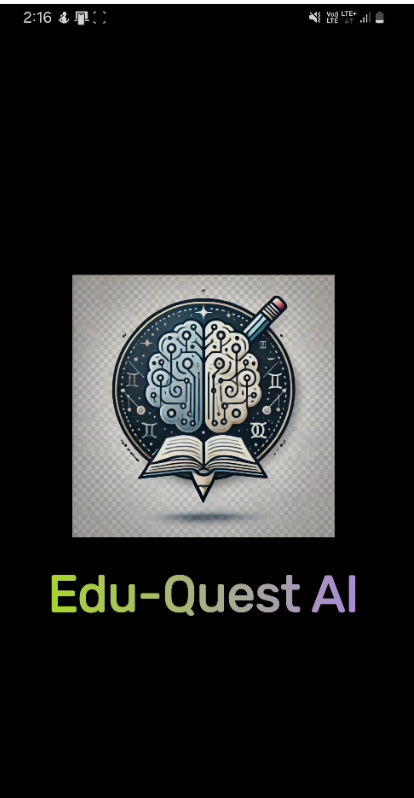
  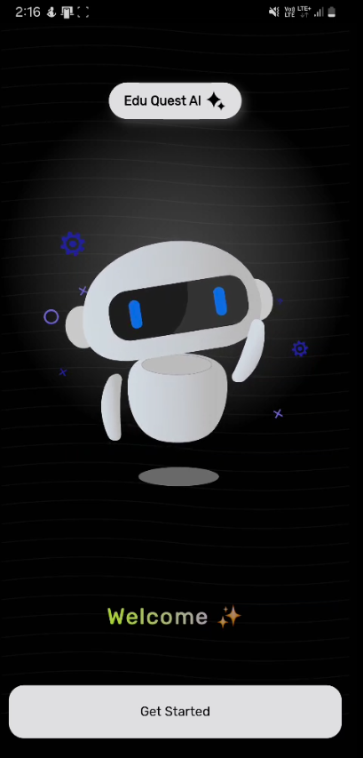
</p>

### 📑 DOC Chat & Q&A Chat
- **DOC Chat:** Allows you to interact directly with your study materials. Simply upload a document (PDF, DOCX, etc.), and the AI chatbot will answer any questions related to the content. Perfect for clarifying complex concepts in real-time.
<p align="center">
  
  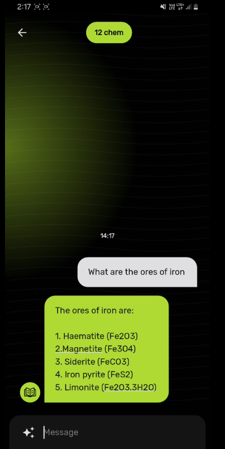
  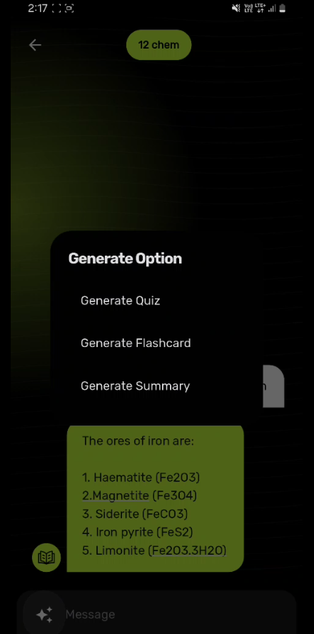
</p>
  
- **Image Chat:** Allows you to interact with complex image questions that cant be texted. Just by uploading the photo and integrating AI with that provides seemless response to the question.
<p align="center">
  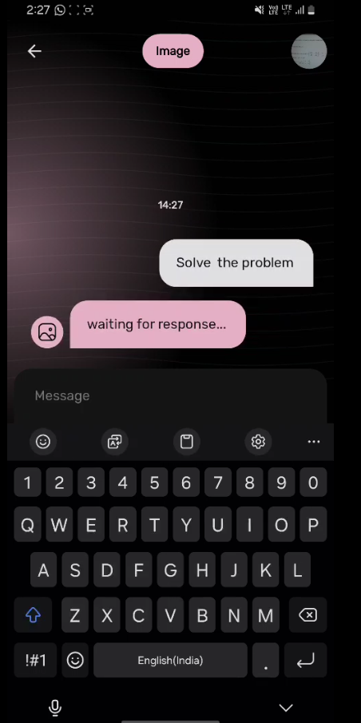
  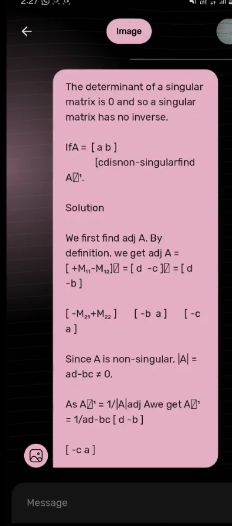
</p>

- **General Purpose:** Allows you to ask any multi domain subjectual questions and get accurate response achieved by prompt engineering and chain of thoughts and powered by Google Gemini model.
<p align="center">
  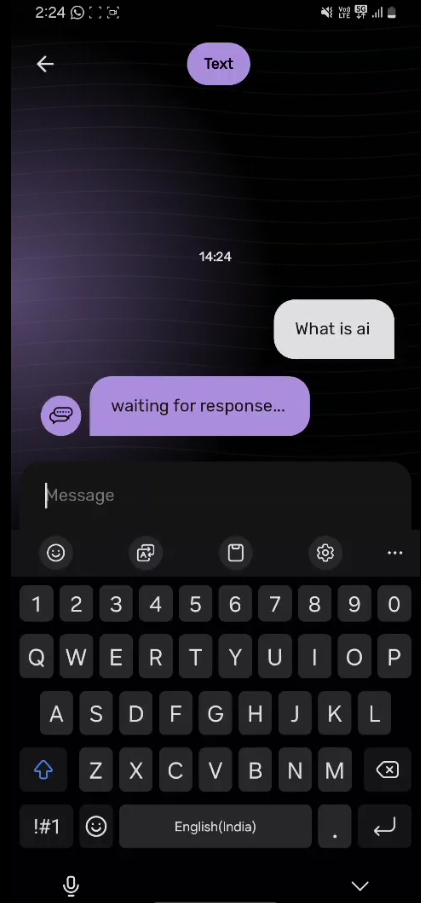
  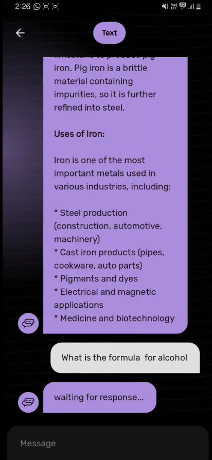
</p>


### 🧠 Personalized Quizzes & Flashcards
- **Quizzes:** Automatically generated quizzes based on your study materials. The app creates questions that are specifically tailored to your learning pace and performance, ensuring that you're always challenged but never overwhelmed.
<p align="center">
  
  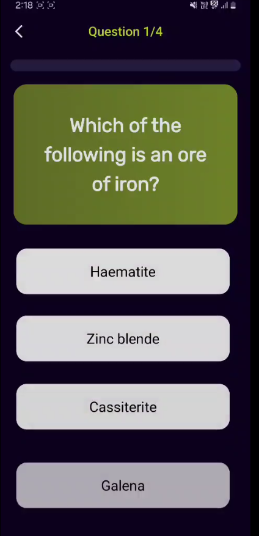
  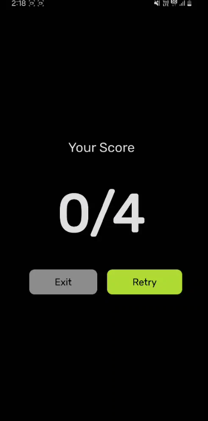
</p>

- **Flashcards:** Helps reinforce learning with flashcards that are automatically created from your study materials. Whether you're prepping for an exam or just reviewing content, flashcards make recall easier and more efficient.
<p align="center">
  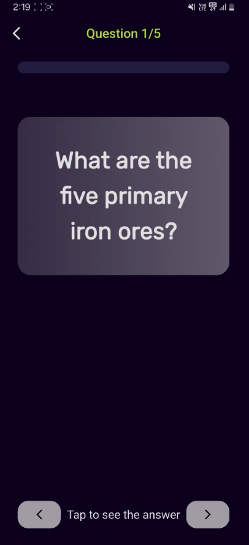
  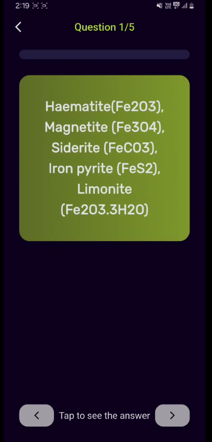
</p>


### 📲 QR Code Book
- **Scan & Learn:** Each textbook or study guide can be enhanced with QR codes. Scanning these codes within the app retrieves related content, and you can even access RAG (Retrieve, Answer, Generate) PDFs, enabling a dynamic and interactive learning experience.
<p align="center">
  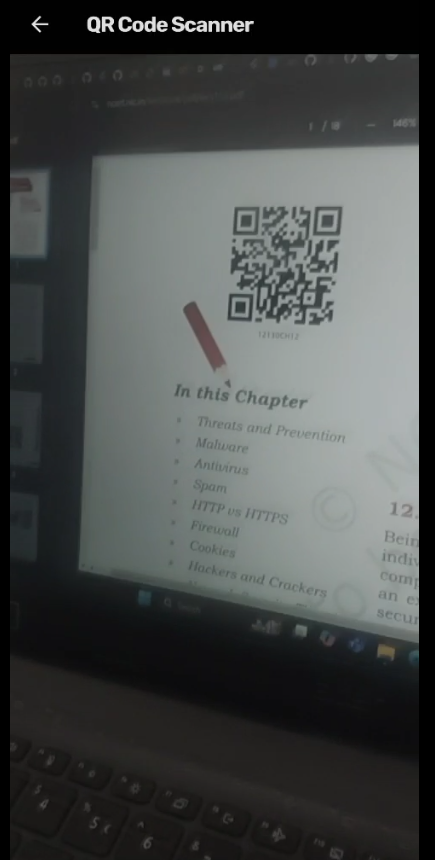
  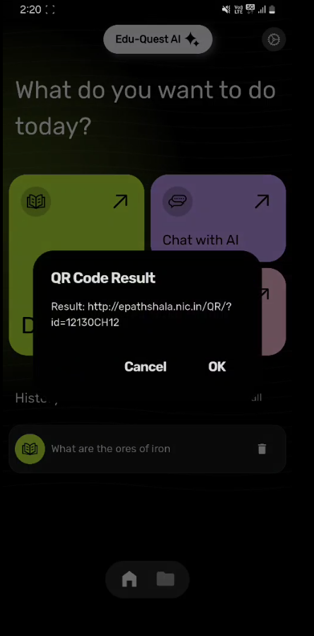
  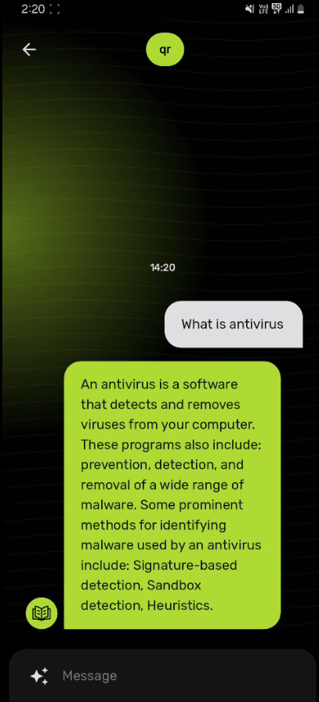
</p>


### 🔄 History & Progress Tracking
- **History Tracking:** Keeps a detailed log of your study sessions, quizzes, and flashcards, making it easy to revisit past content.
<p align="center">
  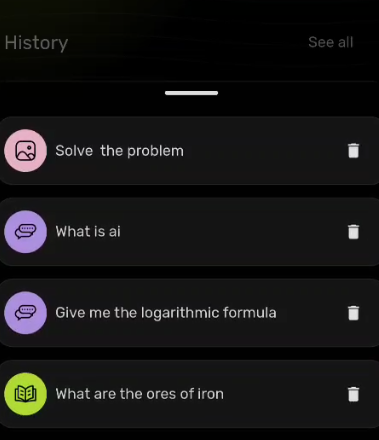
</p> 
- **Progress Tracking:** Monitor your learning progress with features that track quiz performance, document interactions, and flashcard mastery. Never lose sight of your learning journey.
<p align="center">
  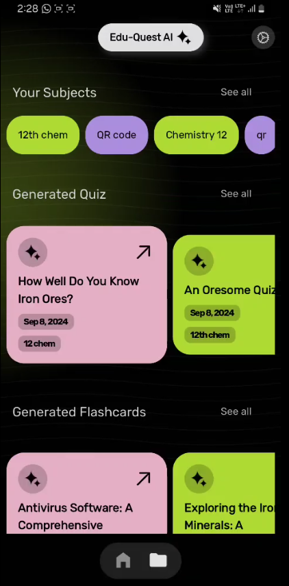
</p>


### 📶 Offline Mode
- **Offline Chatbot:** The Gemma model allows you to continue using the chatbot features without internet access. Whether you're on a plane or in a remote area, your study momentum remains uninterrupted.
<p align="center">
  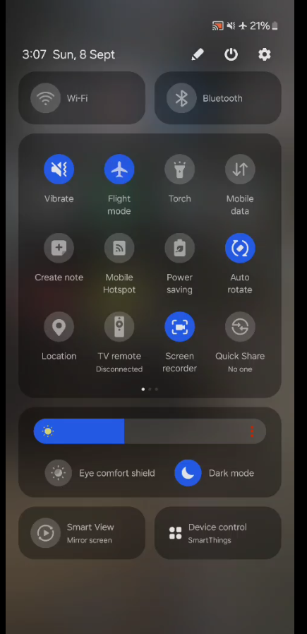
  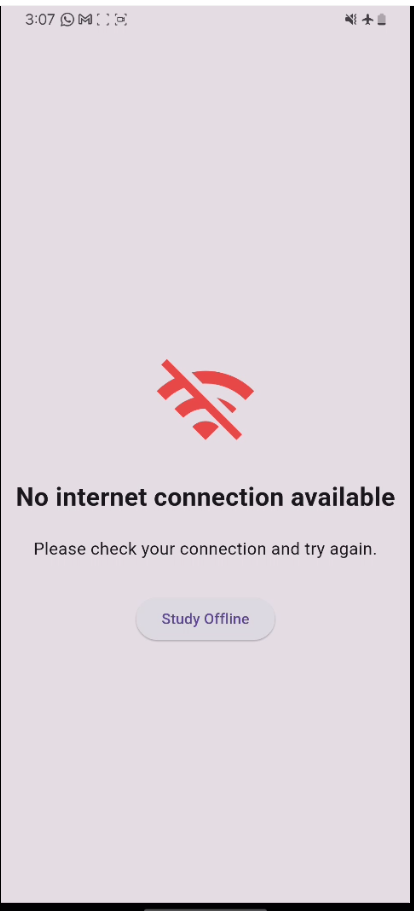
  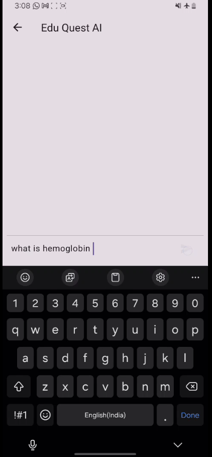
  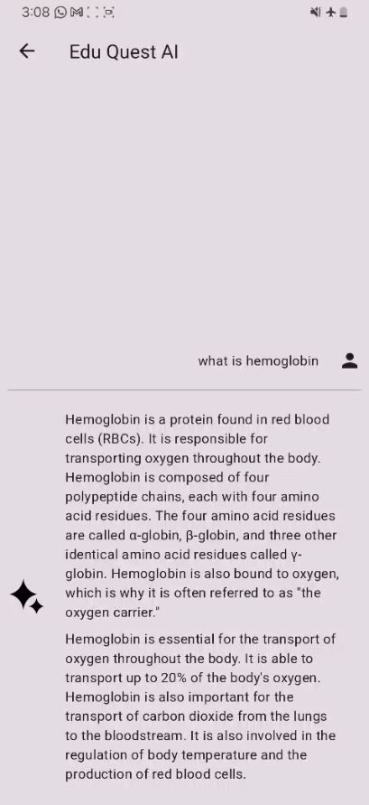
</p>

---

## 🚀 Tech Stack

- **🌐 Frontend:** Built with Flutter for seamless cross-platform app development on iOS and Android.
- **🤖 AI Models:** Utilizes Gemini for online interactions and a fine-tuned Gemma model for offline chatbot functionality.
- **💾 Storage:** Local storage for retaining essential study materials like quizzes and flashcards offline.
- **📕 Integration:** QR code scanning feature to trigger and retrieve related content from textbooks.

---

## 🎯 Target Audience

- **👩‍🎓 Students:** Tailored learning experiences designed to improve retention and engagement.
- **🏫 Educational Institutions & Tutoring Centers:** Tools to enhance teaching methods, monitor progress, and provide personalized learning solutions.
- **🎓 Ministries of Education:** Scalable solutions for educational reform and large-scale implementation across schools.

---

## 🛠️ Installation

1. **Clone the Repository:**
   ```bash
   git clone https://github.com/ArunKumar200510/Edu-Quest.git
   ```
2. **Navigate to the Project Directory:**
   ```bash
   cd Edu-Quest//Edu_Quest_AI
   ```
3. **Install Dependencies:**
   ```bash
   flutter pub get
   ```
4. **Run the App:**
   ```bash
   flutter run
   ```

---

## 🎥 Demo

Project Video : [Click Here](https://drive.google.com/file/d/13_iwjTcDZEY6bNY54Zna3gBgeDMsUiyN/view?usp=sharing)

https://github.com/user-attachments/assets/7c35f636-3115-4f94-bfee-4137e9b25fd5


---

## 🔁 App Flow


This flowchart explains the key components of the app, how they interact with each other, and the overall user experience.

---

## 🛠️ Contributing

We welcome contributions from the community! To contribute:
1. Fork the repository.
2. Create a new branch (`git checkout -b feature-branch`).
3. Make your changes.
4. Push to the branch (`git push origin feature-branch`).
5. Open a pull request.

For more details, please check our [Contributing Guidelines](https://github.com/ArunKumar200510/Edu-Quest/blob/main/CONTRIBUTING.md).

---

## 📝 License

This project is licensed under the MIT License - see the [LICENSE](LICENSE) file for details.

---

## 📧 Contact

Have questions, suggestions, or just want to say hi? Reach out to us at [arun700101@gmail.com](mailto:arun700101@gmail.com). We'd love to hear from you!

---

### ⭐️ If you find this project useful, please give it a star!

---
